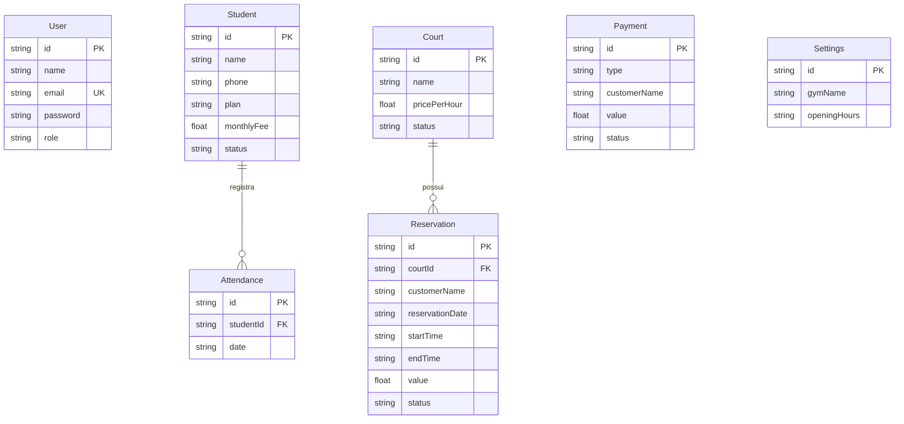

<p align="center">
  <h1 align="center">⚽ ArenaFlow</h1>
  <p align="center">
    Sistema completo de gestão para academias e quadras society
    <br />
    <em>Simplifique sua operação. Elimine planilhas e WhatsApp.</em>
  </p>
</p>

<p align="center">
  
  
  
  
  
</p>

---

## 📋 Sobre o Projeto

O **ArenaFlow** é uma plataforma web mobile-first para gestão unificada de academias e quadras society. Foi desenvolvido para substituir processos manuais (planilhas, anotações em papel e grupos de WhatsApp) por um sistema digital intuitivo e profissional.

### 🎯 Problema que Resolve

Donos de academias e quadras society frequentemente gerenciam tudo de forma manual — anotando alunos em cadernos, controlando pagamentos em planilhas e recebendo reservas via WhatsApp. Isso gera:

- ❌ Perda de informações e dados de clientes
- ❌ Dificuldade em controlar inadimplência
- ❌ Conflitos de horários em reservas de quadras
- ❌ Zero visibilidade financeira em tempo real
- ❌ Retrabalho constante da equipe

### ✅ Solução

O ArenaFlow centraliza toda a operação em um único dashboard:

- 📊 **Visão completa** do negócio em tempo real
- 👥 **Gestão de alunos** com controle de frequência e planos
- 🏟️ **Gestão de quadras** com agenda visual de horários
- 📅 **Reservas inteligentes** com detecção de conflitos
- 💰 **Controle financeiro** completo com filtros e relatórios
- ⚙️ **Configurações personalizáveis** por estabelecimento

---

## 🖥️ Screenshots

> 💡 Execute o projeto localmente para visualizar todas as telas.

| Módulo | Descrição |
|--------|-----------|
| **Login** | Tela de autenticação segura com NextAuth |
| **Dashboard** | Painel com métricas, gráficos e atividades recentes |
| **Alunos** | Lista, cadastro, edição e perfil individual com frequência |
| **Quadras** | Gestão de quadras com horários e valores |
| **Reservas** | Agendamento com calendário e status em tempo real |
| **Financeiro** | Pagamentos, filtros por período e resumo financeiro |
| **Configurações** | Dados do estabelecimento, planos e formas de pagamento |

---

## 🚀 Tecnologias Utilizadas

| Tecnologia | Função |
|------------|--------|
| [Next.js 14](https://nextjs.org/) | Framework React com App Router e SSR |
| [React 18](https://react.dev/) | Biblioteca de UI com componentes reativos |
| [TypeScript](https://www.typescriptlang.org/) | Tipagem estática para maior segurança |
| [Prisma 7](https://www.prisma.io/) | ORM moderno para acesso ao banco de dados |
| [SQLite](https://www.sqlite.org/) | Banco de dados leve para desenvolvimento |
| [NextAuth.js](https://next-auth.js.org/) | Autenticação com sessões seguras |
| [Lucide React](https://lucide.dev/) | Ícones modernos e consistentes |
| [bcrypt.js](https://github.com/dcodeIO/bcrypt.js) | Hash seguro de senhas |
| CSS Puro | Estilização premium sem dependências extras |

---

## 📁 Estrutura do Projeto

```
arenaflow/
├── prisma/
│   ├── schema.prisma          # Modelo de dados
│   ├── seed.ts                # Dados iniciais
│   └── migrations/            # Migrações do banco
├── src/
│   ├── app/
│   │   ├── api/               # Rotas da API REST
│   │   │   ├── auth/          # Autenticação (NextAuth + registro)
│   │   │   ├── students/      # CRUD de alunos
│   │   │   ├── courts/        # CRUD de quadras + horários
│   │   │   ├── reservations/  # CRUD de reservas
│   │   │   ├── payments/      # CRUD de pagamentos
│   │   │   ├── attendance/    # Registro de frequência
│   │   │   ├── dashboard/     # Métricas do painel
│   │   │   └── settings/      # Configurações do sistema
│   │   ├── login/             # Página de login
│   │   ├── dashboard/         # Painel principal
│   │   ├── students/          # Módulo de alunos
│   │   ├── courts/            # Módulo de quadras
│   │   ├── reservations/      # Módulo de reservas
│   │   ├── financial/         # Módulo financeiro
│   │   ├── settings/          # Módulo de configurações
│   │   ├── globals.css        # Design system completo
│   │   ├── layout.tsx         # Layout raiz
│   │   ├── page.tsx           # Redirect para login
│   │   └── providers.tsx      # Providers (NextAuth)
│   ├── components/
│   │   └── AppLayout.tsx      # Layout do app (sidebar + header)
│   ├── lib/
│   │   ├── auth.ts            # Configuração do NextAuth
│   │   └── prisma.ts          # Cliente Prisma singleton
│   └── middleware.ts          # Proteção de rotas
├── .env                       # Variáveis de ambiente (não versionado)
├── .gitignore
├── package.json
├── tsconfig.json
└── README.md
```

---

## 🗄️ Modelo de Dados



---

## ⚙️ Como Executar

### Pré-requisitos

- [Node.js](https://nodejs.org/) 18 ou superior
- [npm](https://www.npmjs.com/) (incluso no Node.js)

### 1. Clone o repositório

```bash
git clone https://github.com/vinigoezz/arenaflow.git
cd arenaflow
```

### 2. Instale as dependências

```bash
npm install
```

### 3. Configure as variáveis de ambiente

Crie um arquivo `.env` na raiz do projeto:

```env
DATABASE_URL="file:./dev.db"
NEXTAUTH_SECRET="sua-chave-secreta-aqui"
NEXTAUTH_URL="http://localhost:3000"
```

> 💡 Gere uma chave secreta com: `openssl rand -base64 32`

### 4. Configure o banco de dados

```bash
npx prisma generate
npx prisma migrate dev
```

### 5. (Opcional) Popule com dados iniciais

```bash
npx tsx prisma/seed.ts
```

### 6. Inicie o servidor de desenvolvimento

```bash
npm run dev
```

Acesse: [http://localhost:3000](http://localhost:3000)

---

## 🔐 Autenticação

O sistema utiliza **NextAuth.js** com provider de credenciais (email/senha).

### Cadastro de Usuário

Faça uma requisição POST para `/api/auth/register`:

```json
{
  "name": "Admin",
  "email": "admin@arenaflow.com",
  "password": "sua-senha-segura",
  "role": "admin"
}
```

### Permissões

| Papel | Descrição |
|-------|-----------|
| `admin` | Acesso total ao sistema, incluindo configurações |
| `recepcionista` | Acesso operacional (alunos, quadras, reservas, financeiro) |

---

## 📡 API REST

Todas as rotas da API ficam em `/api/` e retornam JSON.

| Método | Rota | Descrição |
|--------|------|-----------|
| `GET` | `/api/dashboard` | Métricas do painel |
| `GET/POST` | `/api/students` | Listar / Criar alunos |
| `GET/PUT/DELETE` | `/api/students/[id]` | Detalhe / Editar / Excluir aluno |
| `POST` | `/api/attendance` | Registrar frequência |
| `GET/POST` | `/api/courts` | Listar / Criar quadras |
| `GET/PUT/DELETE` | `/api/courts/[id]` | Detalhe / Editar / Excluir quadra |
| `GET` | `/api/courts/[id]/slots` | Horários disponíveis |
| `GET/POST` | `/api/reservations` | Listar / Criar reservas |
| `PUT/DELETE` | `/api/reservations/[id]` | Editar / Excluir reserva |
| `GET/POST` | `/api/payments` | Listar / Criar pagamentos |
| `PUT` | `/api/payments/[id]` | Atualizar pagamento |
| `GET/PUT` | `/api/settings` | Ler / Atualizar configurações |
| `POST` | `/api/auth/register` | Cadastro de usuário |
| `POST` | `/api/auth/[...nextauth]` | Login / Sessão (NextAuth) |

---

## 🎨 Design

O ArenaFlow foi construído com foco em **experiência premium**:

- 🌙 **Tema escuro** elegante com paleta de cores cuidadosamente selecionada
- 📱 **Mobile-first** — funciona perfeitamente em smartphones e tablets
- ✨ **Micro-animações** e transições suaves para uma experiência fluida
- 🎨 **Glassmorphism** e efeitos visuais modernos
- 🔤 **Tipografia** com a fonte Inter do Google Fonts
- 📐 **Design System** completo com variáveis CSS customizadas

---

## 🚀 Deploy

### Vercel (Recomendado)

1. Faça push do código para o GitHub
2. Conecte o repositório na [Vercel](https://vercel.com)
3. Configure as variáveis de ambiente no painel
4. Deploy automático a cada push

> ⚠️ Para produção, recomenda-se migrar o banco de dados de SQLite para **PostgreSQL** ou **MySQL**, alterando o provider no `prisma/schema.prisma`.

---

## 🤝 Contribuindo

Contribuições são bem-vindas! Para contribuir:

1. Faça um fork do projeto
2. Crie uma branch para sua feature (`git checkout -b feature/nova-funcionalidade`)
3. Commit suas mudanças (`git commit -m 'feat: adiciona nova funcionalidade'`)
4. Push para a branch (`git push origin feature/nova-funcionalidade`)
5. Abra um Pull Request

---

## 📄 Licença

Este projeto está sob a licença MIT. Veja o arquivo [LICENSE](LICENSE) para mais detalhes.

---

## 👤 Autor

Desenvolvido por **[vinigoezz](https://github.com/vinigoezz)**

---

<p align="center">
  Feito com ❤️ para revolucionar a gestão de academias e quadras society
</p>
